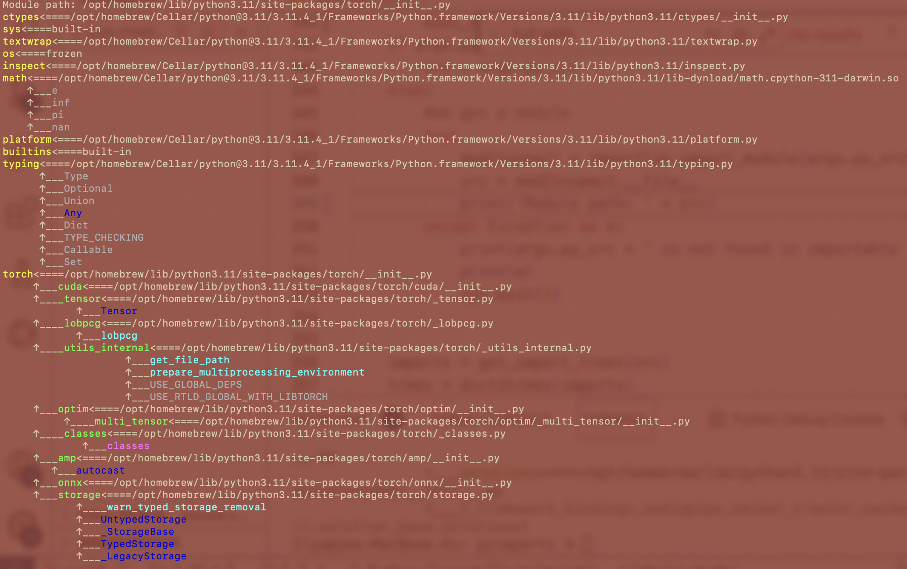

Give a python source to the script and get detailed imports tree in terminal immideately:

    python3 pyimports /path/to/file/to_analyze.py

That can achieve the following effect:

I wanted get all import dependencies for a bunch of python files and to my surprize I found no
simple tool in Python that could it, pydeps is too hefty and more importantly is not a shell utility.

Pyimports shows the dependency trees of a python source and tells which imports are modules, members, etc or if they are not found.
