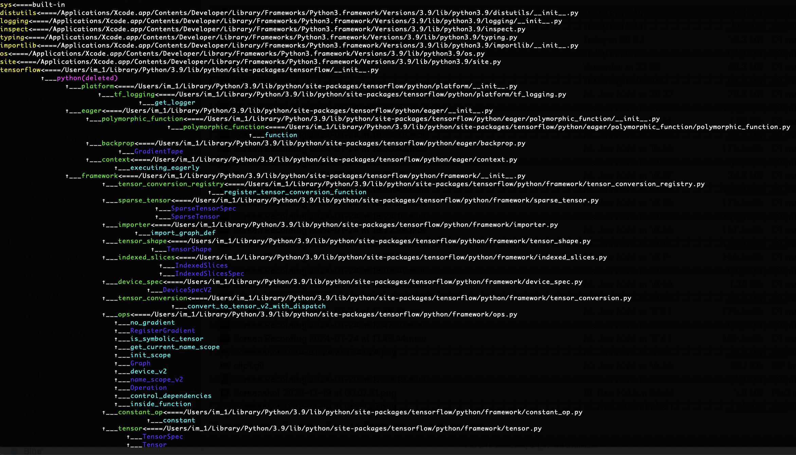

# Unconfuse your Py imports
Pyimps shows you fully, exactly and immediately what you're importing.

If any dependency may present an issue(reloaded module, frozen, or module defined in code from ModuleType() for example) or not found you would see it. Each dependency colored differently so that you see if importing another module or just class, function or const variable. This saves debugging errors or helps making them hermetic especially when bundling, freezing them into applications.

## Installation

```
pip install pyimps
```

## Usage
Use it on a) source.py file b) any module name (main.suba.subb) in sys.path and current path

A complex project like tensorflow will give something like this
```
pyimps tensorflow                                                  
```



I wanted to check and control dependencies for large python codebase to bundled into an application and to my surprize I found no simple tool in Python that could it, pydeps is too hefty and more importantly it does not output to terminal, you need to do extra steps to open the graph in a separate graph reader gui.

On the bigger level the wish was to automate and hermetisize python builds completely, make it possible to forget about package env managers and any things at all that lay outside the project folder, including the interpreter - integrate it seamlesly with other languages in monorepo, which  started to do.
That will allow remote building and cross-building of python apps easily including baking any docker images; That's however is a lot of work ahead